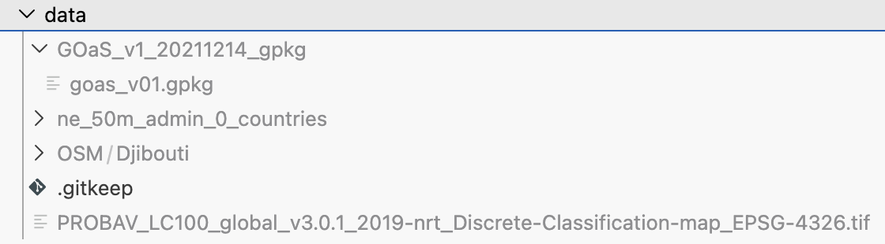
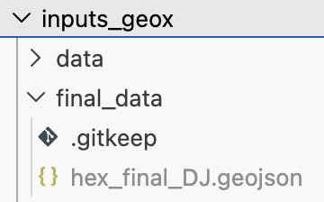
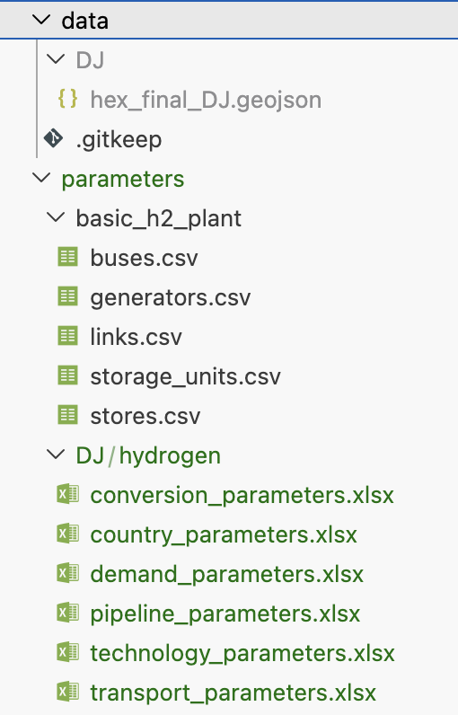
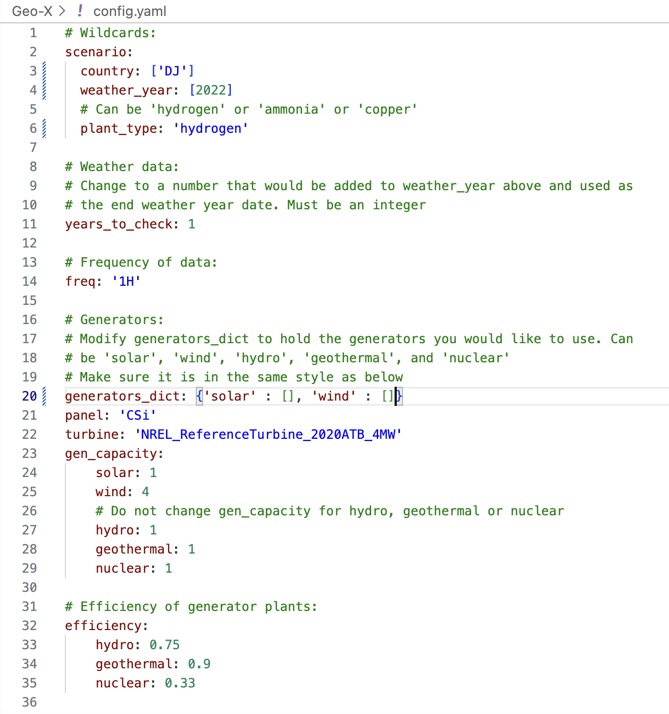
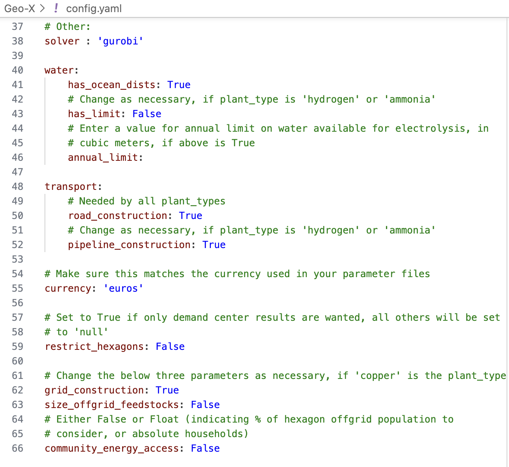
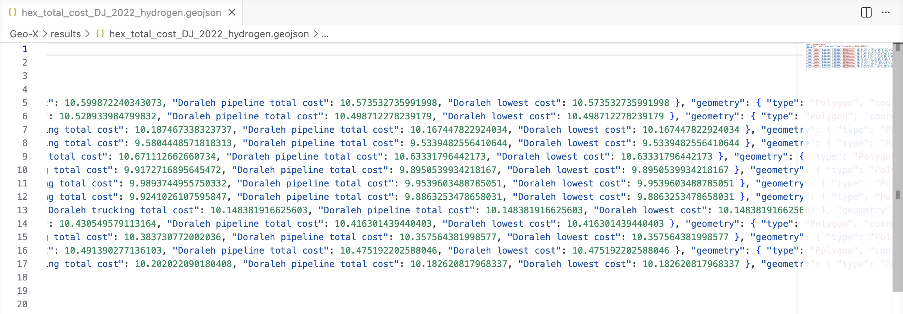
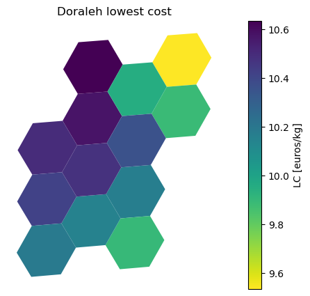

Running model
=============

This page provides a step-by-step example of running Geo-X, from preparing input data to generating results.

The example uses Djibouti as the study area for hydrogen production, and was run on a MacBook Air (2022) using macOS and Visual Studio Code.

.. note::

   The values used in this example are for demonstration purposes only and do not represent real-world results.

Geo-X-data-prep
---------------

Setting up environments
~~~~~~~~~~~~~~~~~~~~~~~

Clone the repository and create the main environment:

.. code-block:: console

   git clone --recurse-submodules https://github.com/ClimateCompatibleGrowth/Geo-X-data-prep.git
   cd Geo-X-data-prep
   mamba env create -f environment.yaml
   mamba activate prep

Set up the SPIDER environment:

.. code-block:: console

   mamba deactivate
   cd ccg-spider/prep
   mamba create -n spider
   mamba activate spider
   mamba install pip gdal
   pip install -e .

Return to the top-level directory.

You should see this when you run the command ``mamba env list``:

.. code-block:: console

   # conda environments:
   prep
   spider

Adding required input data
~~~~~~~~~~~~~~~~~~~~~~~~~~
.. note::

   This example uses a minimal setup (solar and wind only) and does not include
   hydropower, geothermal, nuclear, or slope exclusion data.
   Additional steps are required if these technologies are included.

Download and place the required datasets into the ``data`` folder. These include:

- Country boundary data  
- OpenStreetMap data  
- Land cover data  
- Ocean boundary data (if applicable)  

Ensure that file names and folder structure match the required format.

Running data preparation
~~~~~~~~~~~~~~~~~~~~~~~~

Run the initial preparation step:

.. code-block:: console

   mamba activate prep
   python prep_before_spider.py Djibouti --ocean

Run SPIDER to generate hexagons:

.. code-block:: console

   cd ccg-spider/prep
   mamba activate spider
   gdal_rasterize data/Djibouti.gpkg -burn 1 -tr 0.001 0.001 data/blank.tif && gdalwarp -t_srs EPSG:4088 -tr 100 100 data/blank.tif data/blank_proj.tif && spi --config=Djibouti_config.yml Djibouti_hex.geojson

Run the final preparation step:

.. code-block:: console

   cd ../../
   mamba activate prep
   python prep_after_spider.py Djibouti -ic DJ

This step produces the final hexagon file:

``hex_final_DJ.geojson``

Geo-X
-----

Setting up Geo-X
~~~~~~~~~~~~~~~~

Clone the Geo-X repository and create the environment:

.. code-block:: console

   cd ..
   git clone https://github.com/ClimateCompatibleGrowth/Geo-X.git
   cd Geo-X
   mamba env create -f environment.yaml
   mamba activate geox

Copy the prepared hexagon file into:

``data/DJ/hex_final_DJ.geojson``

Ensure all the parameter files are in the correct location and fully configured for Djibouti:

Configuring the model
~~~~~~~~~~~~~~~~~~~~~

Edit the ``config.yaml`` file to match your scenario:

- Set ``country`` to ``DJ``
- Set ``weather_year`` and ``years_to_check``
- Set ``plant_type`` to ``hydrogen``
- Configure generators and other settings as required

Running the workflow
~~~~~~~~~~~~~~~~~~~~

Download weather data (if required):

.. code-block:: console

   snakemake -j 4 run_weather

Run the optimisation:

.. code-block:: console

   snakemake -j 4 optimise_all

Generate maps and outputs:

.. code-block:: console

   snakemake -j 4 map_all

Results
~~~~~~~

Outputs are saved in the following folders:

- ``results``: Final cost outputs  
- ``resources``: Intermediate results  
- ``plots``: Visualisations  

Example outputs include:

- Total cost maps  
- Cost component breakdowns  
- Spatial distribution of production costs  

|

Notes
-----

- Ensure all required input files are in place before running the workflow
- Weather data downloads may take time and require significant storage
- If inputs are modified, Snakemake will rerun only the necessary steps